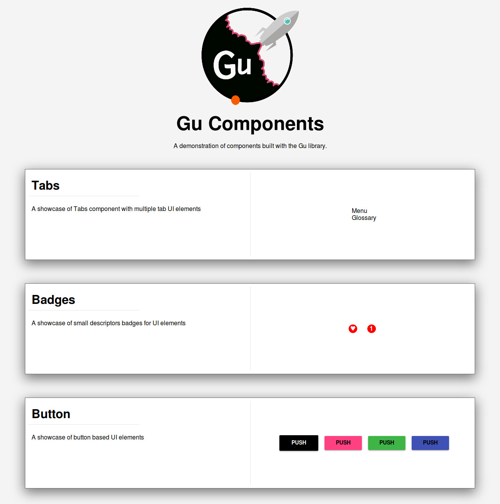

Gu
==

[](https://goreportcard.com/report/github.com/gu-io/gu)
[](https://travis-ci.org/gu-io/gu)

A component rendering library for Go. It efficiently renders standard HTML both on the frontend and backend.

Install
-------

```
go get -u github.com/gu-io/gu/...
```

Example
-------





CLI
---

Gu provides an cli tooling which is installed when `go get` is done for this package, the tooling provides easier means of generating a project and components using the gu project, among other features.

It is provided to both improve the workflow of the user, as well as to provide quick setup of your project. Provided below are examples of workflows which are generally done when developing with Gu.

-	Creating a Gu project

```bash
> ➜ gu app box
- Creating package directory: "box"
- Creating package directory: "box/public"
- Creating package directory: "box/public/less"
- Add file to package directory: "box/public/less/box.less"
- Add file to package directory: "box/settings.toml"
- Add file to package directory: "box/settings_bundle.go"
- Add file to package directory: "box/public_bundle.go"
- Add file to package directory: "box/public/box_bundle.go"
- Add file to package directory: "box/box.go"

```

- Adding a rendering driver that uses GopherJS (https://github.com/gu-io/gopherjs)

```
➜  gu-io cd box

➜  box gu driver js
- Creating package directory: "driver/js"
- Add file to package directory: "driver/js/main.go"
- Add file to package directory: "public/index.html"

```

- Add a component with initial boilerplate

```

➜  box gu component sugarbar
- Creating package directory: "/home/ewe/devlabs/src/github.com/gu-io/box/sugarbar"
- Add file to package directory: "sugarbar/sugarbar.go"
- Add file to package directory: "sugarbar/sugarbar_bundle.go"
- Add file to package directory: "sugarbar/generate.go"

➜  box

```

Goals
-----

-	Dead Simple API.
-	Embeddable Resources.
-	Simplicity and Flexibility as core philosophies.
-	Able to render on both front and back end.
-	Quickly craft your UI without touching HTML.
-	Share code between backend and frontend.

Advantages
----------

-	Complex component libraries can be built up and shared as Golang packages.
-	Components are hierarchical allowing further reuse.
-	Event handling is simple and strongly typed.
-	Compile time safety

Examples
--------

The github repo [Components](https://github.com/gu-io/components) contains gu style components that
showcases how to build components with gu.

Concepts
--------

Gu is fundamentally a library built to provide rendering capabilities with simple principles in building components that make up your application. There exists certain concepts which should be grasped due to the architecture and these do make it easier to reason and thinking when using the library. To fully grasp these concept, there is set below a series of short explanations about the different core pieces that make up the libray and I hope these will help in the use of this libray and it's examples.

-	[Virtual DOM](./docs/concepts/dom.md)

-	[App, Views, Component](./docs/concepts/app.md)

-	[Assets](./docs/concepts/assets.md)

-	[Components](./docs/concepts/components.md)

-	[Routing](./docs/concepts/routing.md)

-	[Notifications](./docs/concepts/notifications.md)

-	[Drivers](./docs/concepts/drivers.md)


How to Contribute
-----------------

Please read the contribution guidelines [Contribution Guidelines](./docs/concepts/contributing.md)

Limitations
-----------

Gu by it's very design and architecture is "Simple". It lacks the bells and whistles of similar frameworks and libraries. It's geared to solve your rendering needs and due to this, certain limitations exists with it.

-	Gu provides no react like flux structure.

-	Gu only focuses on providing you sets of structures able to work on the client and server for HTML/HTML5 rendering markup rendering with diffing support.

-	Gu component are simply Go types that implements Gu's set of interfaces and nothing else.

Once these limitations are not a problem, I believe using the library should help in achieving the end product and design you wish to build.

Last Note
---------

Please feel free to make issues on suggestions, questions, changes, bugs or improvements for the library. They all will be gladly received with much fan-fare.

God bless.
